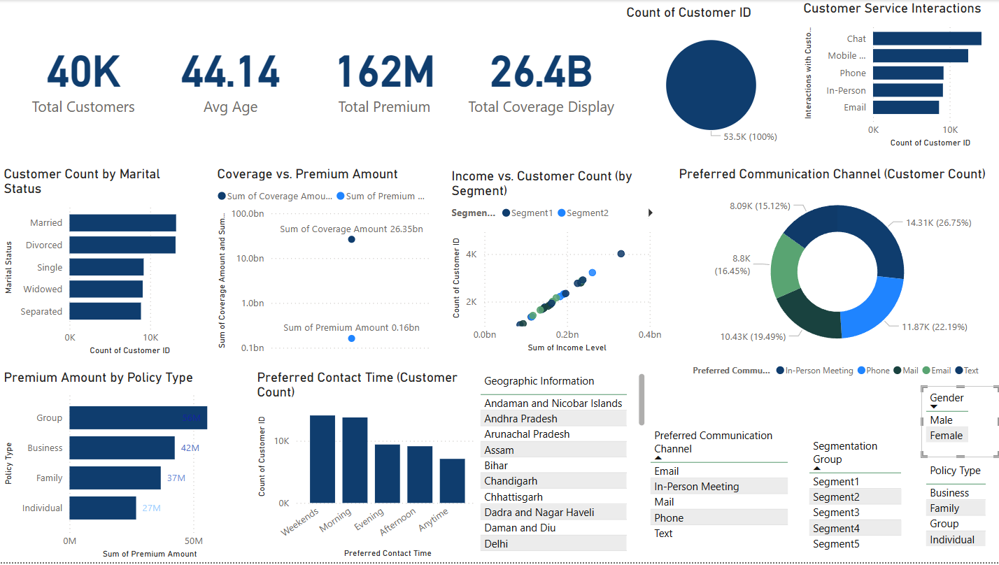

# 📊 Customer Segmentation Dashboard
### 🚀 Power BI Project

## **📌 Project Overview**
This **Power BI dashboard** offers **in-depth analysis** of customer segmentation, policy types, premium coverage, and communication preferences in the **insurance industry**.

### **🎯 Key Business Objectives**
- **Analyze** customer demographics & segmentation groups to identify behavior patterns.
- **Evaluate** premium and coverage trends by policy type.
- **Improve** customer service engagement based on preferred interaction channels.

---

## **📊 Dashboard Features**
### ✅ **Key Insights & Visuals**
- **KPI Cards** – Total Customers, Average Age, Total Premium, Total Coverage  
- **Customer Demographics** – Marital Status, Gender, Segmentation Groups  
- **Financial Analysis** – Premium Amount by Policy Type, Coverage vs. Premium Scatter Plot  
- **Customer Behavior** – Preferred Communication Channel (Donut Chart), Preferred Contact Time  
- **Service Interaction Insights** – Customer Service Interactions by Channel  
- **Interactive Filters & Slicers** – Geographic Region, Policy Type, Segmentation Group  

**Technologies Used:**  
- **Power BI Desktop** for data visualization  
- **DAX (Data Analysis Expressions)** for calculations  
- **Excel Dataset** (imported into Power BI)  

---

## **📂 Dataset Details**
This project uses a **customer segmentation dataset** relevant to insurance policies.

| **Column Name** | **Description** |
|-----------------|-----------------|
| `Customer ID` | Unique identifier for each customer |
| `Age` | Customer's age |
| `Gender` | Male / Female |
| `Income Level` | Financial category of the customer |
| `Policy Type` | Type of insurance policy (Business, Family, Group, Individual) |
| `Coverage Amount` | Total insurance coverage value |
| `Premium Amount` | Amount paid for the policy |
| `Preferred Communication Channel` | Email, Phone, In-Person, Mail, Text |
| `Segmentation Group` | Customer classification (e.g., High-Value, Standard) |

**Dataset Source:** [Kaggle / Synthetic Data]  

---

## **📌 How to Use the Dashboard**
### **1️⃣ Download the .pbix File**
Click here to download: **[`Customer_Segmentation_Dashboard.pbix`](#)**

### **2️⃣ Open in Power BI Desktop**
- Install **[Power BI Desktop](https://powerbi.microsoft.com/en-us/downloads/)** if you haven’t.  
- Open **Customer_Segmentation_Dashboard.pbix**.

### **3️⃣ Interact with the Data**
- **Apply Filters** to explore different customer segments.  
- **Hover over charts** to view tooltips and deeper insights.  
- **Drill down** on bar or donut charts for more detailed analysis.

---

## 📷 **Dashboard Preview**  

---

## **📌 Future Improvements & Enhancements**
- **Advanced DAX Measures** – Additional financial or churn metrics  
- **Predictive Analytics** – Integrate machine learning models for churn prediction  
- **Live Data Connection** – Connect to real-time insurance data via API  

